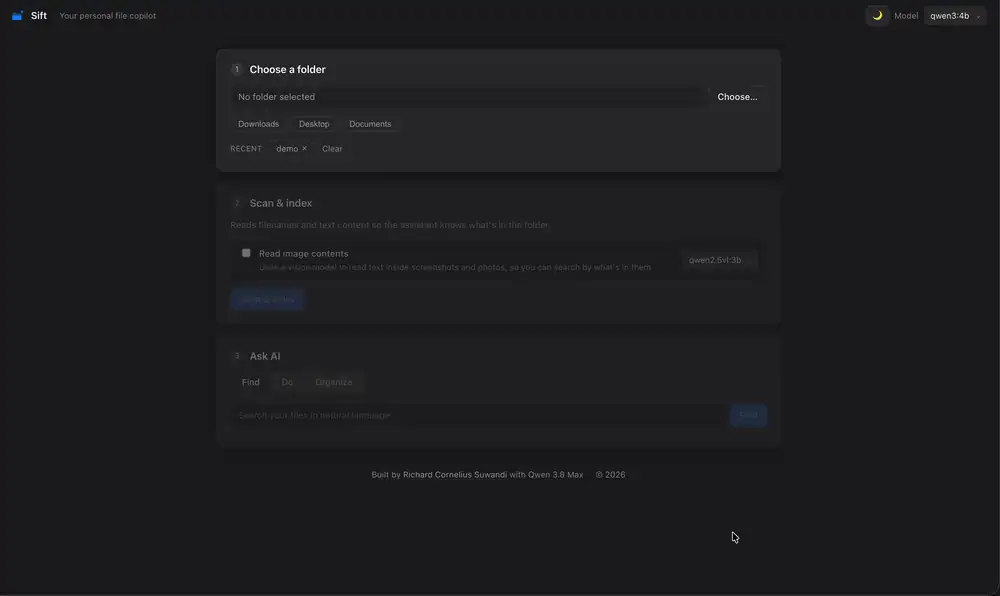
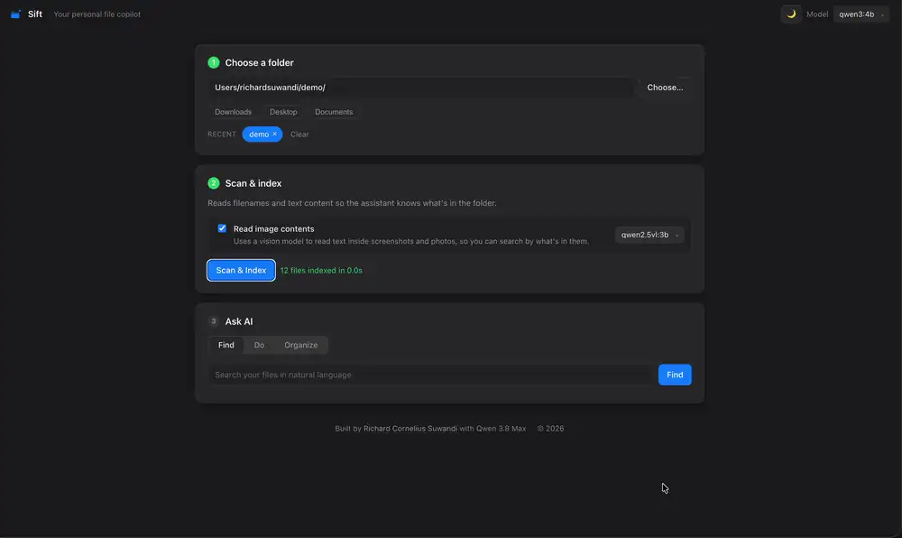
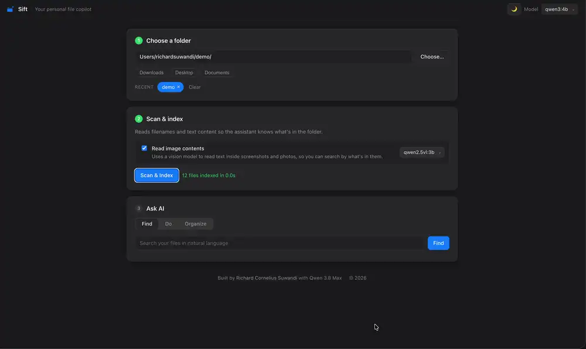
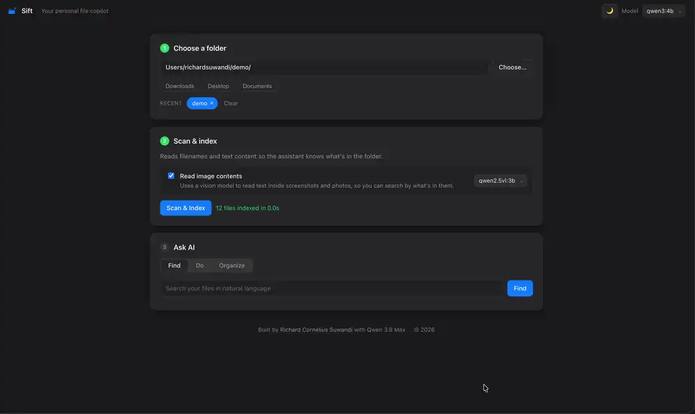

# Sift

**Find, understand, and organize your files with private local AI.**

Sift is a personal file copilot. Ask for a file in natural language, search
inside documents and images, or describe how you want to clean up a folder.
Sift turns every change into an editable plan before it touches anything on
disk. Your files and AI models stay on your computer.

The initial release supports macOS. See [Platform support](#platform-support)
for details.

## What you can do

### Find files by meaning

Search the way you remember. Ask for "the paper about learning from a few
examples" or "the invoice from March." Sift searches filenames and document
contents, then shows the matching evidence so you can verify every result.

<p align="center">
  
</p>

### Search inside screenshots and images

Enable image reading during a scan to find screenshots by their visible text
and visual context, even when the filename tells you nothing useful.

<p align="center">
  
</p>

### Organize a folder as one collection

Sift reviews the full batch and proposes useful categories, subfolders, and
clearer filenames. Related files stay together instead of being classified
into inconsistent one-off folders.

<p align="center">
  
</p>

### Move, rename, or trash files in plain English

Say "move all PDFs into Papers," "rename these papers as author_year_title,"
or "trash the installers." Every instruction becomes a reviewable
before-and-after plan.

<p align="center">
  
</p>

### Stay in control

- Review the complete before-and-after tree before anything moves.
- Edit individual destinations, skip files, or apply only selected changes.
- Undo the last applied batch, including files moved to the Trash.
- Prevent overwrites with automatic collision-safe names.
- Keep credentials and system folders out of scope with built-in path guards.

## Why Sift

Sift brings file search, AI organization, and natural-language actions into one
experience. It is useful when you know what a file means but not what it is
called. It is also useful when you know the result you want but do not want to
build and maintain a permanent automation rule.

| Area              | **Sift**                                                                                      | **Existing file organizers**                                               |
| ----------------- | --------------------------------------------------------------------------------------------- | -------------------------------------------------------------------------- |
| Core experience   | Understand, find, and organize files in one place                                             | Primarily sort, rename, or move files                                      |
| Search            | Natural-language search across filenames, documents, and indexed images with visible evidence | Commonly relies on filenames, metadata, filters, or manually defined rules |
| Organization      | Proposes a coherent folder structure from the contents of the full batch                      | Commonly sorts each file using predefined categories or conditions         |
| Instructions      | Accepts plain-language requests to move, rename, group, or trash files                        | Commonly uses menus, profiles, rules, or fixed workflows                   |
| Personalization   | Learns preferred folder names from the corrections you apply                                  | Commonly requires categories or rules to be configured manually            |
| Review and safety | Provides an editable plan, selective apply, collision protection, and one-click undo          | Preview, editing, and undo support vary by product                         |
| AI and privacy    | Uses your choice of local AI models and keeps file contents on your Mac                       | AI and cloud usage vary by product                                         |

Sift is not only for cleaning up a folder. It helps you understand and find
your files first, then turns that understanding into a safe organization plan
that you can review and control.

## Supported content

Sift reads filenames and common document formats, including PDF, Word,
PowerPoint, Excel, plain text, Markdown, source code, LaTeX, and BibTeX. With a
local vision model, it can also index PNG, JPEG, GIF, BMP, WebP, TIFF, and HEIC
images.

## Install Sift on macOS

### Recommended setup

You only need to complete these steps once. After setup, open Sift by clicking
the Sift app icon.

1. Install and open [Ollama](https://ollama.com/download).
2. Download this repository with **Code → Download ZIP**, then unzip it.
3. Double-click `Install Sift.command` in the unzipped folder.
4. Wait while Sift downloads its default local models and prepares the app.
5. Finder will reveal `Sift.app` when setup is complete. Double-click the
   blue Sift icon to open it.

You can drag `Sift.app` into your Applications folder or Dock. Keep the
downloaded Sift folder in place because the app uses the files inside it.

If macOS blocks the installer or app on the first launch, Control-click it,
choose **Open**, then confirm that you want to open it.

## CLI mode

<p align="center">
  
</p>

The CLI needs two local tools: [Ollama](https://ollama.com/download) to run the
models and [uv](https://docs.astral.sh/uv/) to install the isolated `sift`
command. Install both, then run:

```bash
git clone https://github.com/richardcsuwandi/sift.git
cd sift
ollama pull qwen3:4b
uv tool install .
sift ~/Downloads
```

`sift PATH` opens an agent-style session scoped to that folder. The terminal
header keeps the active folder, chat model, and index state visible while a
persistent prompt accepts plain-English questions and slash commands. Before
the prompt appears, Sift refreshes new and changed files and reuses everything
unchanged, so later launches stay quick.

Ask where a file is, describe a move or rename, or ask Sift to organize the
folder. Search answers cite matching local evidence, and `/reveal` selects the
top result in Finder without leaving the session.

Natural-language changes are never applied silently. Sift shows a before/after
plan and immediately offers approve, decline, toggle, edit, and save controls.
Organization builds its proposed destination tree live. Applied batches can be
restored with `/undo`.

The interactive commands are:

```text
/scan [--images]  rescan files; optionally read image contents
/organize         propose a complete folder structure
/plan             show a postponed plan
/apply            reopen a plan you postponed
/undo             restore the last applied batch
/folder PATH      switch folders and refresh their index
/model [NAME]     show model roles or select the chat model
/reveal           select the top search result in Finder
/status           show the folder, index, and model configuration
/help             show the command guide
/clear            clear the terminal
/exit             leave Sift
```

The model view explains which local Ollama model handles chat and organization,
which creates search embeddings, and which reads images. Pull the default chat
model before starting:

```bash
ollama pull qwen3:4b
```

For faster meaning-based search, install the default embedding model:

```bash
ollama pull qwen3-embedding:0.6b
```

For search inside screenshots and images, install the default vision model:

```bash
ollama pull qwen2.5vl:3b
```

Image reading is deliberately opt-in because it is slower:

```text
/scan --images
```

Sift automatically lists compatible models installed in Ollama. These models
are defaults, not requirements. You can choose other compatible local models
with `/model NAME` or from the browser app.

The same operations are scriptable without opening an interactive session:

```bash
sift status ~/Downloads
sift ask "Where is my March invoice?" --folder ~/Downloads
sift plan "move all PDFs into Papers" --folder ~/Downloads --save papers.json
sift apply papers.json
sift organize ~/Downloads --save organize.json
sift reveal ~/Downloads/invoice.pdf
sift undo
```

## Platform support

Sift is designed as a general local file copilot. The initial release supports
macOS because it currently integrates with Finder, the macOS Trash, and a
native macOS launcher. Windows and Linux are not officially supported in this
release.

## Privacy and safety

Sift does not upload filenames, document text, images, prompts, or embeddings.
The interface runs on localhost, the models run through your local Ollama
installation, and the search index stays in the ignored `data/` directory.

Scanning never changes your files. Organization results and instructions stay
as proposals until you approve them. Delete requests move items to the macOS
Trash instead of permanently erasing them. You can undo the most recent batch
from the app.

## License

[MIT](LICENSE) © Richard Cornelius Suwandi.

Built by [Richard Cornelius Suwandi](https://richardcsuwandi.github.io) with [Qwen 3.8 Max](https://qwen.ai/blog?id=qwen3.8).
